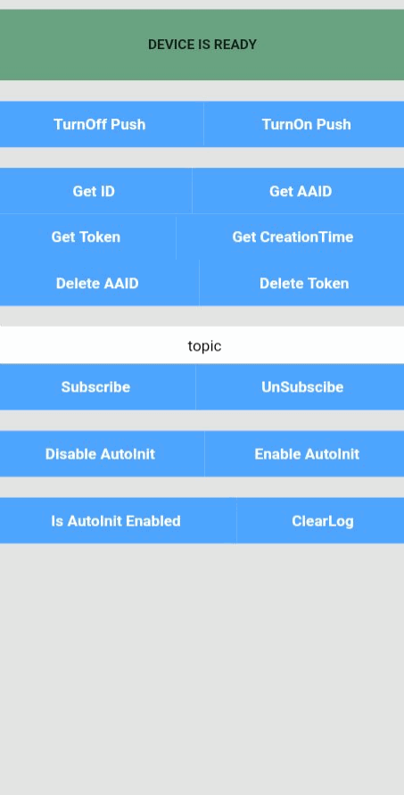
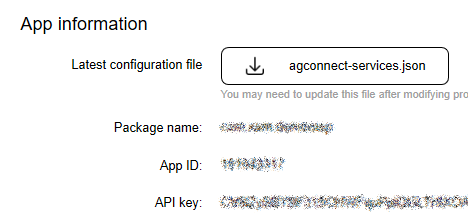

# CORDOVA-PLUGIN-HMS-PUSH DEMO


- Contents
- Introduction
- Installation Guide
- Cordova SDK API Method Definition
- Configure description
- Licensing and Terms

## 1. Introduction
The Cordova SDK code encapsulates the Huawei push client interface. It provides many APIs for your reference or use.

The Cordova SDK code package is described as follows:

**src/main/:** core layer, bridging PushSDK bottom-layer code;

**www/HMSPush.js:** external interface definition layer, which is used to define interface classes or reference files.

## 2. Installation Guide

  1. Download the Cordova Push SDK Plugin.
  2. Add Platform To Project.

***```cordova platform add android```***

3. Run the following command in the root directory of the Cordova project:
   
***```cordova plugin add PATH_TO_CORDOVA_PUSH_SDK```***

4. check whether the Cordova Push SDK is successfully added to Plugin folder in the root directory of the Cordova project.

5. Download **agconnect-services.json** file from AppGallery Connect.
6. Add **agconnect-services.json** and **jks** file to root directory.
   


7. Add **build.json** file to your project's root.


8. Make sure widget id is same as your package name in config.xml. Otherwise demo project will not work properly.
 


9. Then run the Cordova app 

***```cordova run android```***


## 3. Cordova SDK API Methods & Constant Definitions
   
    HMSPush   
        turnOffPush(CallbackContext callbackContext):void
        turnOnPush(CallbackContext callbackContext):void
        getID(CallbackContext callbackContext):void
        getAAID(CallbackContext callbackContext):void
        getToken(CallbackContext callbackContext):void
        sendToken(String token):void
        getCreationTime(CallbackContext callbackContext):void
        deleteAAID(CallbackContext callbackContext):void
        deleteToken(CallbackContext callbackContext):void
        subscribe(JSONArray topic, CallbackContext callbackContext):void
        unsubscribe(JSONArray topic, CallbackContext callbackContext):void
        disableAutoInit(CallbackContext callbackContext):void
        enableAutoInit(CallbackContext callbackContext):void
        isAutoInitEnabled(CallbackContext callbackContext):void
        onMessageReceived(CallbackContext callbackContext):void
        
    CordovaHmsMessageService    
        onMessageReceived(): void    
        onDeletedMessages():void 
        onMessageSent(String msgId):void  
        onSendError(String msgId, Exception exception):void  
        onNewToken(String token):void 
        
    Constants
        RESULT_SUCESS   
        RESULT_FAIL    
        PARAMETR_IS_EMPTY 
        TOKEN_NOT_EXISTS
 


## 4. Configure parameters.    
No.

## 5. Licensing and Terms  
Apache 2.0 license.
