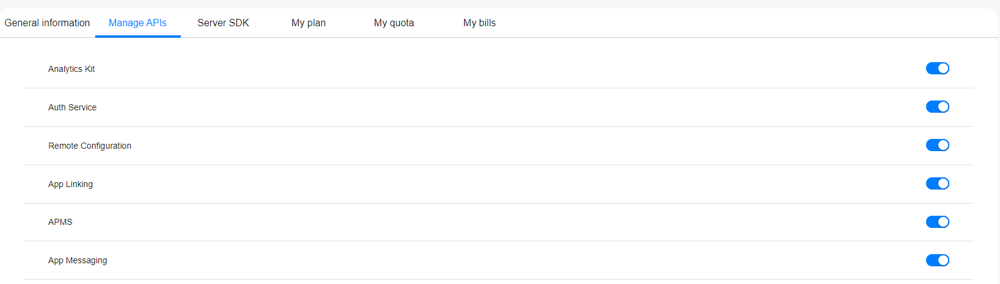
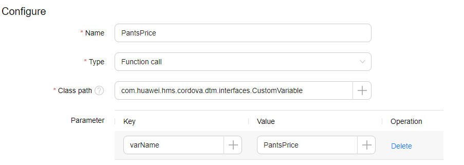
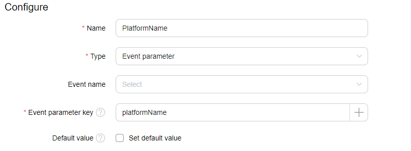
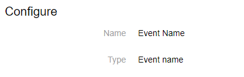
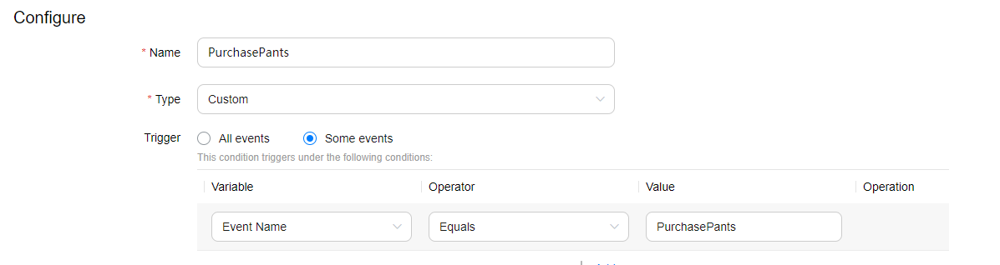
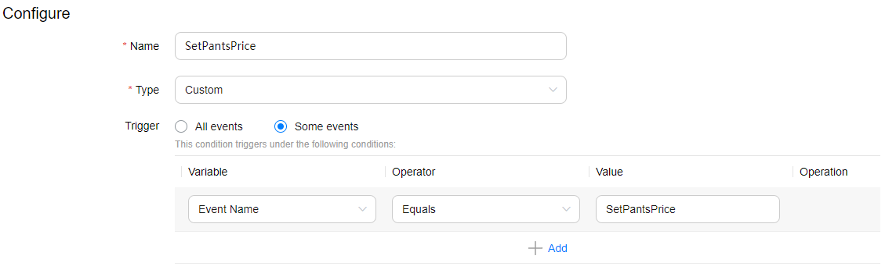
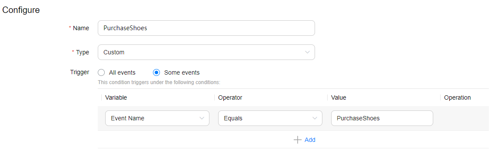
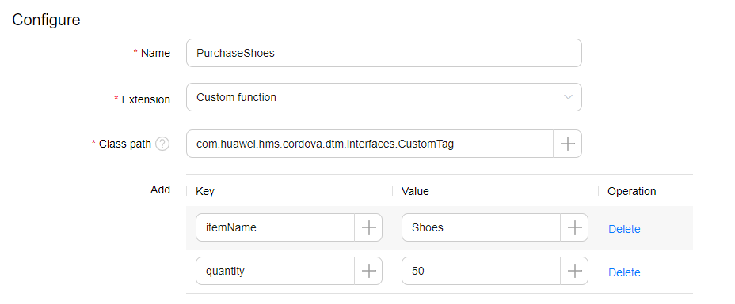
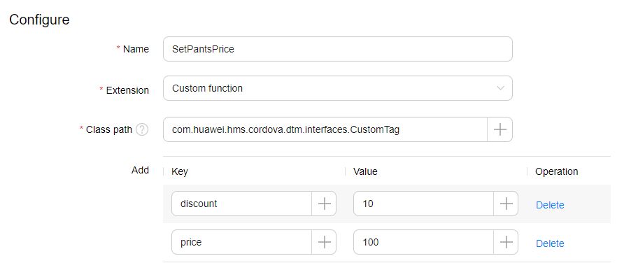
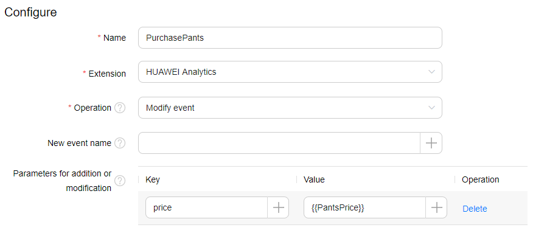

# HMS DTM Cordova Demo

## Contents

- [1. Introduction](#1-introduction)
- [2. Installation Guide](#2-installation-guide)
  - [2.1. Creating a Project in AppGallery Connect](#21-creating-a-project-in-appgallery-connect)
  - [2.2. Configuring the Signing Certificate Fingerprint and Obtaining agconnect-services.json](#22-configuring-the-signing-certificate-fingerprint-and-obtaining-agconnect-servicesjson)
  - [2.3. Cordova](#23-cordova)
- [3. Configuration and Description](#3-configuration-and-description)
- [4. Questions or Issues](#4-questions-or-issues)
- [5. Licencing and Terms](#5-licencing-and-terms)

---

## 1. Introduction

This demo application demonstrates the usage of HMS DTM Kit Cordova plugin.

---

## 2. Installation Guide

Before you get started, you must register as a HUAWEI Developer and complete identity verification on the [HUAWEI Developer](https://developer.huawei.com/consumer/en/) website. For details, please refer to [Register a HUAWEI ID](https://developer.huawei.com/consumer/en/doc/10104).

### 2.1. Creating a Project in AppGallery Connect

Creating an app in AppGallery Connect is required in order to communicate with the Huawei services. To create an app, perform the following steps:

1. Sign in to [AppGallery Connect](https://developer.huawei.com/consumer/en/service/josp/agc/index.html)  and select **My projects**.
2. Select your project from the project list or create a new one by clicking the **Add Project** button.
3. Go to **Project Setting** > **General information**, and click **Add app**.
If an app exists in the project and you need to add a new one, expand the app selection area on the top of the page and click **Add app**.
4. On the **Add app** page, enter the app information, and click **OK**.

### 2.2. Configuring the Signing Certificate Fingerprint and Obtaining agconnect-services.json

A signing certificate fingerprint is used to verify the authenticity of an app when it attempts to access an HMS Core (APK) through the HMS SDK. Before using the HMS Core (APK), you must locally generate a signing certificate fingerprint and configure it in the **AppGallery Connect**. You can refer to 3rd and 4th steps of [Generating a Signing Certificate](https://developer.huawei.com/consumer/en/codelab/HMSPreparation/index.html#2) Codelab tutorial for the certificate generation. Perform the following steps after you have generated the certificate.

1. Sign in to [AppGallery Connect](https://developer.huawei.com/consumer/en/service/josp/agc/index.html) and select your project from **My Projects**. Then go to **Project Setting** > **General information**. In the **App information** field, click the  icon next to SHA-256 certificate fingerprint, and enter the obtained **SHA-256 certificate fingerprint**.
2. After completing the configuration, click **OK** to save the changes. (Check mark icon)
3. In the same page, click **agconnect-services.json** button to download the configuration file.

### 2.3. Cordova

1. Install Cordova CLI.

    ```bash
    npm install -g cordova
    ```

2. Open the demo project root folder.

3. Add the **Android platform** to the project.

    ```bash
    cordova platform add android
    ```

4. Install `HMS DTM plugin` to the project. You can either install the plugin through `npm` or by `downloading from HMS Core Plugin page`.

    a. Run the following command in the root directory of your project to install it through **npm**.

    ```bash
    cordova plugin add @hmscore/cordova-plugin-hms-dtm
    ```

    b. Or download the plugin from [Plugin > DTM Kit > Cordova Plugin](https://developer.huawei.com/consumer/en/doc/overview/HMS-Core-Plugin) page and run the following command in the root directory of your project to **install it manually**.

    ```bash
    cordova plugin add <hms_cordova_dtm_plugin_path>
    ```

5. Copy **`agconnect-services.json`** file to **`<project_root>/platforms/android/app`** directory.

6. First, make sure that  [DTM configurations](#operations-on-the-server) are completed in AppGallery Connect > Dynamic Tag Manager page. Go to **`platforms/android/app/src/main/assets`** directory in your project and create a folder with **`containers`** name. Then add `DTM-********.json` file that you downloaded from AppGalery Connect. 

6. Add **`keystore(.jks)`** and **`build.json`** files to your project's root directory.

    - You can refer to 3rd and 4th steps of [Generating a Signing Certificate](https://developer.huawei.com/consumer/en/codelab/HMSPreparation/index.html#2) Codelab tutorial page for generating keystore file.
    - Fill **`build.json`** file according to your keystore information. For example:

    ```json
    {
        "android": {
            "debug": {
                "keystore": "<keystore_file>.jks",
                "storePassword": "<keystore_password>",
                "alias": "<key_alias>",
                "password": "<key_password>"
            },
            "release": {
                "keystore": "<keystore_file>.jks",
                "storePassword": "<keystore_password>",
                "alias": "<key_alias>",
                "password": "<key_password>"
            }
        }
    }
    ```

7. Update the widget **`id`** property which is specified in the **`config.xml`** file. It must be same with **client > package_name** value of the **`agconnect-services.json`** file.

8. Enable Analytics API  on AppGallery Connect to use DTM.

    > To use HUAWEI DTM, you need to enable analytics **[enable analytics for DTM Kit](https://developer.huawei.com/consumer/en/doc/distribution/app/agc-enable_service#h1-1574822945685)** .

    

9. Run the application.

    ```bash
    cordova run android --device
    ```

---

## 3. Configuration and Description

### Operations On the Server

#### Overview

To access the DTM portal, perform the following steps:

1. Sign in to [AppGallery Connect](https://developer.huawei.com/consumer/en/service/josp/agc/index.html) and click **My projects**.
2. Find your app project, and click the desired app name.
3. On the **Project Setting** page, go to **Growing** > **Dynamic Tag Manager**.

Enable the HUAWEI Analytics first and set Data Storage Location. Than press Create Configuration button and create configuration for DTM.

If you created configuration, you must create **Variables**, **Tags** and **Conditions** to use Demo. These are given below:

#### Create Variable

A variable is a placeholder used in a condition or tag. For example, the App Name variable indicates the name of an Android app. DTM provides preset variables which can be used to configure most tags and conditions. You can also create your own custom variables. Currently, DTM provides 18 types of preset variables and 6 types of custom variables. Preset variable values can be obtained from the app without specifying any information. For a custom variable, you need to specify the mode to obtain its value.

Go to **Variable** section in **Dynamic Tag Manager** page.

**Step 1)** Create a custom variable.

   - **Name** : PantsPrice

   - **Type** : Function call

   - **Class path** : com.huawei.hms.cordova.dtm.interfaces.CustomVariable

   - **Key:** varName , **Value:**  PantsPrice

     


**Step 2)** Create a  variable.

   - **Name** : PlatformName

   - **Type** : Event parameter

   - **Event parameter key** : platformName

     


**Step 3)** Create a  parameter (Event Name).

   - Press **Configure** button in **Variable** page. Then click **Event Name** and press **OK**.  

     

#### Create Condition

A condition is the prerequisite for triggering a tag and determines when the tag is executed. A tag must contain at least one trigger condition.

Go to **Condition** section in **Dynamic Tag Manager** page.

**Step 1)** Create a  condition for PurchasePants tag.

   - **Name** : PurchasePants

   - **Type** : Custom

   - **Trigger** : Some events

        - **Variable** : Event Name
        - **Operator** : Equals
        - **Value** : PurchasePants

     

**Step 2)** Create a  condition for SetPantsPrice tag.

   - **Name** : SetPantsPrice

   - **Type** : Custom

   - **Trigger** : Some events

        - **Variable** : Event Name
        - **Operator** : Equals
        - **Value** : SetPantsPrice

     

**Step 3)** Create a  condition for PurchaseShoes tag.

   - **Name** : PurchaseShoes

   - **Type** : Custom

   - **Trigger** : Some events

        - **Variable** : Event Name
        - **Operator** : Equals
        - **Value** : PurchaseShoes

     

#### Create Tag

A tag is used in your app to track events. DTM supports the HUAWEI Analytics and custom function templates, as well as many third-party tag extension templates. With DTM, you do not need to add additional third-party tracking tags in your app. You can set parameters and trigger conditions for a tag in DTM, and release the configuration version to track events. You can also update and release tags for your app in DTM after you have released it, so you can adjust tag configurations in real time.

Go to **Tag** section in **Dynamic Tag Manager** page.

**Step 1)** Create a  Custom Tag for CustomTag button.

   - **Name** : PurchaseShoes

   - **Extension** : Custom Function

   - **Class path** : com.huawei.hms.cordova.dtm.interfaces.CustomTag

   - **Add**

     - **Key:** itemName , **Value:** Shoes
     - **Key:** quantity , **Value:**  50

        

- **Condition** : PurchaseShoes

**Step 2)** Create a Custom Tag to setCustomVariable.

   - **Name** : SetPantsPrice

   - **Extension** : Custom Function

   - **Class path** : com.huawei.hms.cordova.dtm.interfaces.CustomTag

   - **Add**

     - **Key:** discount , **Value:** 10
     - **Key:** price , **Value:**  100

     

- **Condition** : SetPantsPrice

**Step 3)** Create a  Tag to customVariable result.

   - **Name** : PurchasePants

   - **Extension** : HUAWEI Analytics

   - **Add**

     - **Key:** price , **Value:**  {{PantsPrice}}

     

- **Condition** : PurchasePants

#### Create Version

Go to **Version** section in **Dynamic Tag Manager** page. Press **Create** button in **Version** page. Enter a version name and click **OK**. Press the version which is created. Then click the **Release** button. After that click the **Download** button. DTM-***\*\**\**.json  file will  download.

Go to **`platforms/android/app/src/main/assets`** directory in your project and create a folder with **`containers`** name. Then add `DTM-********.json` file that you downloaded from AppGalery Connect.

---

## 4. Questions or Issues

If you have questions about how to use HMS samples, try the following options:

- [Stack Overflow](https://stackoverflow.com/questions/tagged/huawei-mobile-services) is the best place for any programming questions. Be sure to tag your question with **`huawei-mobile-services`**.
- [GitHub](https://github.com/HMS-Core/hms-cordova-plugin) is the official repository for these plugins, You can open an issue or submit your ideas.
- [Huawei Developer Forum](https://forums.developer.huawei.com/forumPortal/en/home?fid=0101187876626530001) HMS Core Module is great for general questions, or seeking recommendations and opinions.
- [Huawei Developer Docs](https://developer.huawei.com/consumer/en/doc/overview/HMS-Core-Plugin) is place to official documentation for all HMS Core Kits, you can find detailed documentations in there.

If you run into a bug in our samples, please submit an issue to the [GitHub repository](https://github.com/HMS-Core/hms-cordova-plugin).

---

## 5. Licencing and Terms

Huawei DTM Kit Cordova Plugin is licensed under the [Apache 2.0 license](LICENCE).
