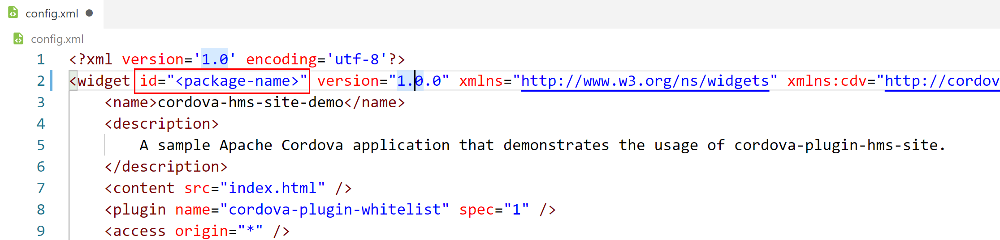
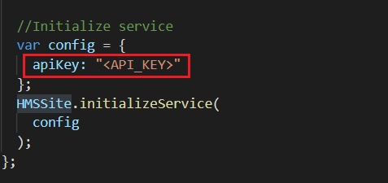

# cordova-hms-site-demo

## Contents
1. Introduction
2. Installation Guide
3. Function Definitions
4. Configuration & Description
5. Licencing & Terms

## 1. Intruduction
This demo application demonstrates the usage of Cordova HMS Site plugin.

## 2. Installation Guide
- Download agconnect-services.json and put it under the root directory of the project.
- Add keystore file and build.json file to your project's root and configure build.json file according to keystore information.
```json
{
    "android": {
        "debug": {
            "keystore": "<keystore>",
            "storePassword": "<password>",
            "alias": "<alias>",
            "password" : "<password>"
        },
        "release": {
            "keystore": "<keystore>",
            "storePassword": "<password>",
            "alias": "<alias>",
            "password" : "<password>"
        }
    }
}
```
- Update the widget id property which is specified in config.xml file. It should be same as the package name which is defined in agconnect-services.json file.



- Update the API key which is specified in 'www/js/index.js' file. It should be same as the API key which is defined in agconnect-services.json file.



- Download cordova-plugin-hms-site plugin.
- Run following commands in the root directory of project respectively.
```
cordova platform add android
cordova plugin add @hmscore/cordova-plugin-hms-site
```

- Execute following command to run application
```
cordova run android
```
## 3. Function Definitions

| Return Type     | Function                                | Description                                                                                                                                                                                                    |
|:----------------|:----------------------------------------|----------------------------------------------------------------------------------------------------------------------------------------------------------------------------------------------------------------|
| Promise\<any>   | initializeService(config)               | Call the initializeService method to initialize the HMSSite service. A configuration object which contains apiKey must be passed as a parameter.                                                               |
| Promise\<Sites> | textSearch(textSearchRequest)           | With this function, users can specify keywords, coordinate bounds, and other information to search for places such as tourist attractions, enterprises, and schools.                                           |
| Promise\<Sites> | detailSearch(detailSearchRequest)       | With this function, users can search for details about a place based on the unique ID of the place.                                                                                                            |
| Promise\<Sites> | querySuggestion(querySuggestionRequest) | With this function, your app can return search suggestions during the user input.                                                                                                                              |
| Promise\<Sites> | nearbySearch(nearbySearchRequest)       | With this function, your app can return a list of nearby places based on the current location of a user. When the user selects a place, the app obtains the place ID and searches for details about the place. |
| Promise\<Sites> | widgetSearch(widgetSearchRequest)       | The widget is a search component of the built-in place search suggestion feature. When a user enters a keyword in the search box, the widget displays a list of suggested places to the user.                  |
| Promise< void >                   | enableLogger()                                      | This method is called to enables the HMSLogger for sends some statistics for the development of functions in the cordova-plugin-hms-site plugin.                              |
| Promise< void >                   | disableLogger()                                     | This method is called to diables the HMSLogger for stops sending some statistics for the development of functions in the cordova-plugin-hms-site plugin.                       |


#### Public Methods

##### Future\<any> HMSSite.initializeService(config)

Call the initializeService method to initialize the HMSSite service. A configuration object which contains apiKey must be passed as a parameter.

###### Parameters
| Name   | Description                                                                                                                               |
|--------|-------------------------------------------------------------------------------------------------------------------------------------------|
| config | Configuration that contains the value of apiKey obtained from HUAWEI AppGallery Connect, which is required for the start of the services. |


##### Future\<Sites> HMSSite.textSearch(textSearchRequest)

With this function, users can specify keywords, coordinate bounds, and other information to search for places such as tourist attractions, enterprises, and schools. 

###### Parameters
| Name              | Description                           |
|-------------------|---------------------------------------|
| textSearchRequest | Request object used for place search. |


##### Future\<Sites> HMSSite.detailSearch(detailSearchRequest)

With this function, users can search for details about a place based on the unique ID of the place.                                                        

###### Parameters
| Name                | Description                                   |
|---------------------|-----------------------------------------------|
| detailSearchRequest | Request object used for place details search. |


##### Future\<Sites> HMSSite.querySuggestion(querySuggestionRequest)

With this function, your app can return search suggestions during the user input.                                                       

###### Parameters
| Name                   | Description                                                   |
|------------------------|---------------------------------------------------------------|
| querySuggestionRequest | Request object used for search suggestions during user input. |


##### Future\<Sites> HMSSite.nearbySearch(nearbySearchRequest)

With this function, your app can return a list of nearby places based on the current location of a user. When the user selects a place, the app obtains the place ID and searches for details about the place.                                                       

###### Parameters
| Name                | Description                                      |
|---------------------|--------------------------------------------------|
| nearbySearchRequest | Request object used to search for nearby places. |


##### Future\<Site> HMSSite.widgetSearch(widgetSearchRequest)

The widget is a search component of the built-in place search suggestion feature. When a user enters a keyword in the search box, the widget displays a list of suggested places to the user.                                                        

###### Parameters
| Name                | Description                                         |
|---------------------|-----------------------------------------------------|
| widgetSearchRequest | Request object used to search for place suggestion. |

## 3. Confuguration & Description
No.

## 4. Licencing & Terms
Apache 2.0 license.

